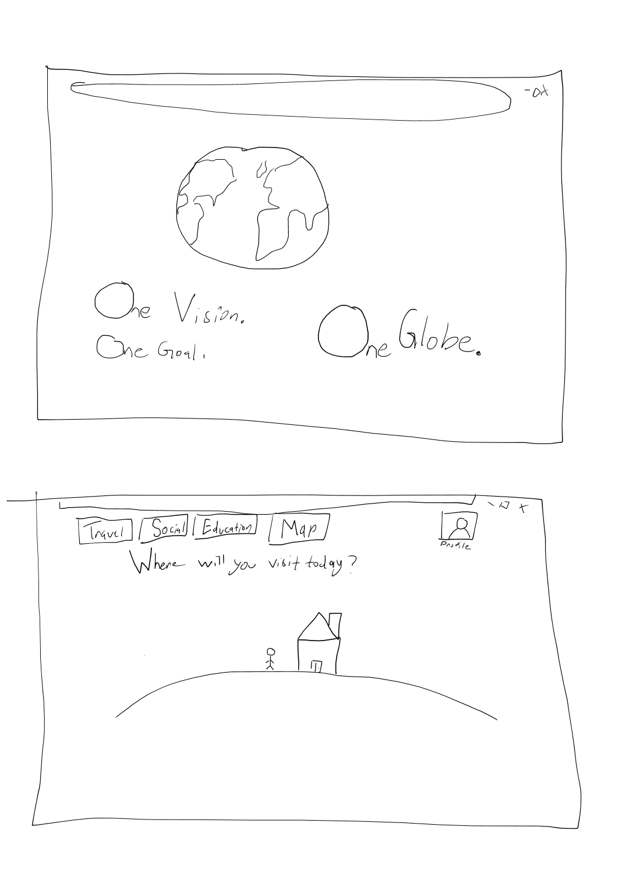
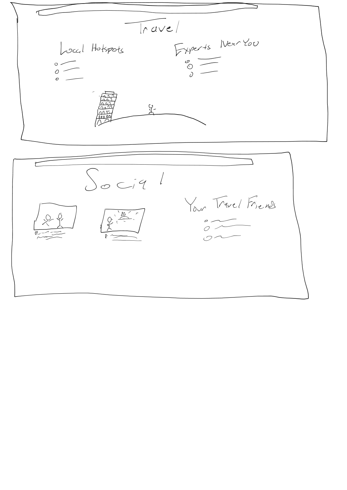
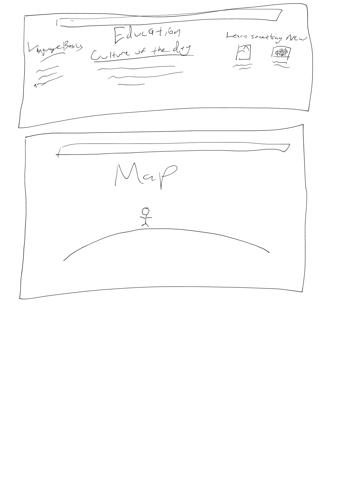

# startup
## CS260 Startup project

This project will be completed over the course of the 2023 Winter Semester.
Project details can be found on GitHub.

Licensed to Myles Barney.
#### ------------------------------------------------

IP for webpage is https://3.136.102.1/

Domain name is https://oneglobe.click

Webpage is hosted by AWS.
#### ------------------------------------------------
Command for SSH is ssh -i [key pair file] ubuntu@3.136.102.1

# Simon
The Simon project is all about learning to use basic HTML structures and tools so that they can be applied to the startup website.  As of today I have learned to use basic forms and outputs, hyperlinks and svg drawing.  It has been a great experience for me.
Here is the link for the Simon [github](https://github.com/myl15/simon) and the Simon page on my [website](https://simon.oneglobe.click/).

# CodePen
Links to CodePen assignments can be found on the OneGlobe website, and i will post some here.
- [OneGlobe Animation](https://codepen.io/myl15/pen/Exexaep)

# OneGlobe
### What is OneGlobe?

In the modern era, the world feels smaller than ever.  Anyone can find the information they are looking for with a few taps on their phone or clicks on their computer.  You can view resource after resource about any destination anywhere on the globe!  But, at OneGlobe we believe there is no substitute for real human interaction.  That's why we are committed to bridging differences between people in order to make the world feel a little bit safer for everyone. We hope to bring people together as users explore and make exciting discoveries all over the world.  OneGlobe is more than a tourism service, and it is more than a social media platform; OneGlobe is a mechanism for real social change all over the world.

### Key Features
+ Ability to connect with individuals from other cultures around the world
+ Tools for international travelers to find travel assistance and contact locals
+ See suggestions from local experts on places to eat and visit based on your location, in **Real Time!**
+ Learn about other cultures and countries everyday
+ See your friends' travels and share your own experiences

### Link to Website
#### [OneGlobe](https://oneglobe.click)

